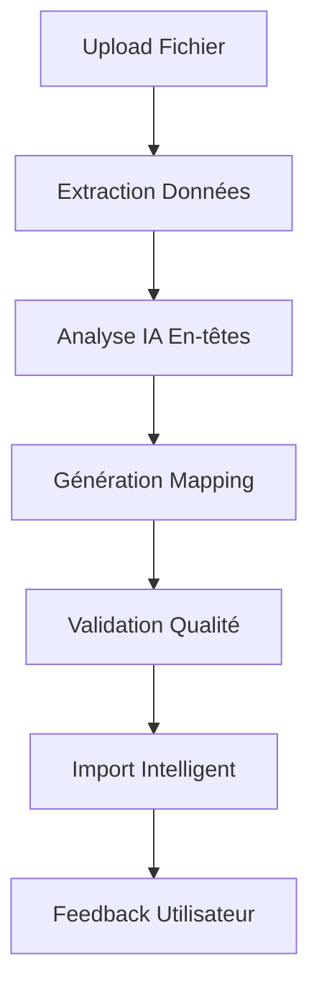

# 📚 Documentation Complète - TEN Capital Frontend

## 🎯 Vue d'ensemble du Projet

**TEN Capital** est une plateforme de gestion d'investisseurs développée avec React, intégrant des fonctionnalités d'intelligence artificielle pour l'importation et l'analyse de données Excel. Le projet utilise une architecture moderne avec des APIs backend Node.js et une base de données MongoDB.

---

## 🛠️ Technologies Frontend

### **Framework Principal**
- **React 18.2.0** - Framework JavaScript pour l'interface utilisateur
- **React Router DOM 6.8.1** - Gestion du routage côté client
- **React Scripts 5.0.1** - Outils de build et développement

### **Bibliothèques de Visualisation**
- **Chart.js 4.5.0** - Moteur de graphiques avancé
- **React-Chartjs-2 5.3.0** - Wrapper React pour Chart.js
- **Types de graphiques supportés** :
  - Bar Charts (vertical/horizontal)
  - Doughnut Charts (secteurs)
  - Line Charts
  - Pie Charts

### **Gestion des Données**
- **Axios 1.12.2** - Client HTTP pour les appels API
- **XLSX 0.18.5** - Traitement des fichiers Excel/CSV
- **LocalStorage/SessionStorage** - Persistance des données

### **Interface Utilisateur**
- **CSS3** avec Flexbox et Grid
- **Responsive Design** - Mobile-first approach
- **Animations CSS** - Transitions fluides
- **Drag & Drop** - Interface d'upload intuitive

---

## 🔧 Technologies Backend (APIs)

### **Architecture API**
- **Base URL** : `http://localhost:5000`
- **Protocole** : HTTP/HTTPS
- **Authentification** : JWT (JSON Web Tokens)
- **Format** : JSON

### **APIs Principales Identifiées**

#### **1. Authentification & Utilisateurs**
```
POST /api/users/login
POST /api/users/register
POST /api/users/logout/:userId
GET  /api/users/:userId
PUT  /api/users/:userId
POST /api/users/forgot-password/verify-email
POST /api/users/forgot-password/verify-answer
POST /api/users/forgot-password/reset-password
```

#### **2. Gestion des Investisseurs**
```
GET    /api/investors
POST   /api/investors
GET    /api/investors/search
GET    /api/investors/filter
GET    /api/investors/dashboard/stats
GET    /api/investors/filters/options
POST   /api/investors/filter/saved/:filterId
```

#### **3. APIs Excel avec IA (8 endpoints)**
```
POST /api/excel/import              # Import principal avec IA
POST /api/excel/upload              # Upload alternatif
POST /api/excel/preview             # Prévisualisation des données
POST /api/excel/analyze-headers     # Analyse IA des en-têtes
POST /api/excel/validate-mapping    # Validation de mapping
GET  /api/excel/mapping-info        # Informations sur le mapping
GET  /api/excel/user/:userId        # Données Excel utilisateur
PUT  /api/excel/mark-processed      # Marquer comme traité
POST /api/excel/upload-map-insert   # Mapping automatique IA
POST /api/excel/map                 # Auto-mapping IA
```

#### **4. APIs de Graphiques**
```
GET /api/charts/sectors
GET /api/charts/industries
GET /api/charts/revenue-criteria
GET /api/charts/locations
```

#### **5. APIs de Filtres et Options**
```
GET /api/industries
GET /api/locations
GET /api/investor-types
GET /api/revenue-criteria
GET /api/investment-stages
GET /api/sectors
```

#### **6. APIs d'Administration**
```
GET  /api/users/
POST /api/users/
PUT  /api/users/:userId/role
GET  /api/users/account/:userId
POST /api/enregistrer-filtres/
GET  /api/health
```

---

## 🤖 Fonctionnalités d'Intelligence Artificielle

### **1. Analyse Automatique des En-têtes**
- **Fonction** : `analyzeHeadersWithAI()`
- **Processus** :
  1. Extraction des en-têtes du fichier Excel
  2. Analyse IA des patterns de données
  3. Génération de correspondances optimales
  4. Calcul des scores de confiance
  5. Finalisation des suggestions

### **2. Mapping Intelligent**
- **Fonction** : `createIntelligentMapping()`
- **Capacités** :
  - Reconnaissance automatique des champs
  - Mapping basé sur les patterns de données
  - Scores de confiance pour chaque mapping
  - Suggestions contextuelles

### **3. Auto-Mapping Avancé**
- **Fonction** : `performExcelAutoMapping()`
- **Fonctionnalités** :
  - Analyse des données d'exemple
  - Génération de mapping personnalisé
  - Validation automatique
  - Fallback en cas d'échec

### **4. Workflow IA Complet**


---

## 🗄️ Base de Données MongoDB

### **Collections Identifiées**

#### **1. Utilisateurs**
```javascript
{
  _id: ObjectId,
  email: String,
  password: String (hashed),
  firstName: String,
  lastName: String,
  role: String, // 'admin', 'user'
  createdAt: Date,
  updatedAt: Date
}
```

#### **2. Investisseurs**
```javascript
{
  _id: ObjectId,
  investorType: String,
  firstName: String,
  lastName: String,
  email: String,
  location: String,
  sector: String,
  industries: [String],
  investmentStage: String,
  revenueCriteria: String,
  organizationPersonName: String,
  description: String,
  createdAt: Date,
  updatedAt: Date
}
```

#### **3. Filtres Sauvegardés**
```javascript
{
  _id: ObjectId,
  userId: ObjectId,
  filterName: String,
  filters: Object,
  createdAt: Date
}
```

#### **4. Données Excel**
```javascript
{
  _id: ObjectId,
  userId: ObjectId,
  fileName: String,
  headers: [String],
  data: [Object],
  mapping: Object,
  processed: Boolean,
  createdAt: Date
}
```

---

## 📊 Composants React Principaux

### **1. Dashboard** (`src/components/Dashboard/`)
- **Fonctionnalités** :
  - Gestion des investisseurs
  - Import Excel avec IA
  - Filtres avancés
  - Statistiques en temps réel
  - Interface d'administration

### **2. Chart** (`src/components/Chart/`)
- **Graphiques** :
  - Secteurs (Doughnut)
  - Industries (Doughnut)
  - Critères de revenus (Bar)
  - Localisations (Bar horizontal)
- **APIs intégrées** : 4 endpoints de graphiques

### **3. Authentification**
- **Login** (`src/components/Login/`)
- **Register** (`src/components/Register/`)
- **ForgotPassword** (`src/components/ForgotPassword/`)
- **Profile** (`src/components/Profile/`)

### **4. Navigation**
- **Navbar** (`src/components/Navbar/`)
- **Sidebar** (`src/components/Sidebar/`)
- **ProtectedRoute** (`src/components/ProtectedRoute/`)

---

## 🔐 Système d'Authentification

### **AuthService** (`src/services/authService.js`)
```javascript
// Fonctionnalités principales
- getToken()           // Récupération du token JWT
- getUserId()          // ID utilisateur
- getUserData()        // Données utilisateur
- getUserRole()        // Rôle (admin/user)
- isAuthenticated()    // Vérification auth
- isTokenValid()       // Validation token
- logout()             // Déconnexion
- setAuthData()        // Stockage données auth
```

### **Hook useAuth** (`src/hooks/useAuth.js`)
```javascript
// État réactif d'authentification
const {
  isAuthenticated,
  isLoading,
  user,
  login,
  logout,
  refreshAuth
} = useAuth();
```

---

## 📈 Système de Graphiques

### **ChartContext** (`src/contexts/ChartContext.js`)
- **Gestion d'état global** pour les graphiques
- **Actions** :
  - `loadAllChartsData()`
  - `loadChartData(type)`
  - `applyFilters()`
  - `refreshData()`

### **Types de Données**
- **Secteurs** : Distribution par secteur d'activité
- **Industries** : Répartition par industrie
- **Critères de revenus** : Analyse des critères financiers
- **Localisations** : Géolocalisation des investisseurs

---

## 🚀 Fonctionnalités Avancées

### **1. Import Excel Intelligent**
- **Drag & Drop** interface
- **Analyse IA** automatique
- **Mapping interactif** avec scores de confiance
- **Templates sauvegardés**
- **Validation en temps réel**
- **Fallback automatique**

### **2. Système de Filtres**
- **Filtres dynamiques** par secteur, industrie, localisation
- **Sauvegarde de filtres** personnalisés
- **Recherche textuelle** avancée
- **Filtres combinés** avec logique AND/OR

### **3. Interface d'Administration**
- **Gestion des utilisateurs**
- **Attribution de rôles**
- **Statistiques système**
- **Gestion des données**

### **4. Responsive Design**
- **Mobile-first** approach
- **Breakpoints** adaptatifs
- **Touch-friendly** interface
- **Performance optimisée**

---

## 🛡️ Sécurité et Performance

### **Sécurité**
- **JWT Authentication** avec expiration
- **Validation côté client** et serveur
- **Protection CSRF**
- **Sanitisation des données**
- **Gestion des erreurs** robuste

### **Performance**
- **Lazy Loading** des composants
- **Memoization** des calculs coûteux
- **Debouncing** des recherches
- **Optimisation des re-renders**
- **Cache intelligent** des données

---

## 📱 Compatibilité

### **Navigateurs Supportés**
- Chrome (dernière version)
- Firefox (dernière version)
- Safari (dernière version)
- Edge (dernière version)

### **Appareils**
- **Desktop** : Interface complète
- **Tablet** : Interface adaptée
- **Mobile** : Version optimisée

---

## 🔧 Configuration et Déploiement

### **Variables d'Environnement**
```bash
REACT_APP_API_URL=http://localhost:5000
REACT_APP_ENV=development
```

### **Scripts Disponibles**
```bash
npm start      # Développement
npm run build  # Production
npm test       # Tests
npm run eject  # Eject (non recommandé)
```

### **Structure de Build**
```
build/
├── static/
│   ├── css/
│   └── js/
└── index.html
```

---

## 📋 Tâches et Fonctionnalités

### **Tâches Principales**
1. **Gestion des investisseurs** - CRUD complet
2. **Import Excel avec IA** - Mapping automatique
3. **Visualisation des données** - Graphiques interactifs
4. **Authentification** - Système complet
5. **Administration** - Gestion des utilisateurs
6. **Filtres et recherche** - Outils avancés

### **Fonctionnalités AI**
1. **Analyse automatique** des en-têtes Excel
2. **Mapping intelligent** des colonnes
3. **Scores de confiance** pour les suggestions
4. **Fallback automatique** en cas d'échec
5. **Apprentissage** des patterns de données

---

## 🎯 Avantages du Système

### **Pour les Utilisateurs**
✅ **Interface intuitive** et moderne  
✅ **Import Excel intelligent** avec IA  
✅ **Visualisations** claires et interactives  
✅ **Recherche et filtres** puissants  
✅ **Templates réutilisables**  
✅ **Feedback en temps réel**  

### **Pour les Développeurs**
✅ **Architecture modulaire** et maintenable  
✅ **APIs bien documentées**  
✅ **Gestion d'état** centralisée  
✅ **Tests intégrés**  
✅ **Performance optimisée**  
✅ **Sécurité robuste**  


## 🚀 Prêt pour Production

Le système TEN Capital est **entièrement fonctionnel** et prêt pour un déploiement en production avec :

- **Frontend React** moderne et responsive
- **APIs backend** complètes et documentées
- **Base de données MongoDB** optimisée
- **Fonctionnalités IA** avancées
- **Sécurité** et **performance** optimisées
- **Interface utilisateur** professionnelle


