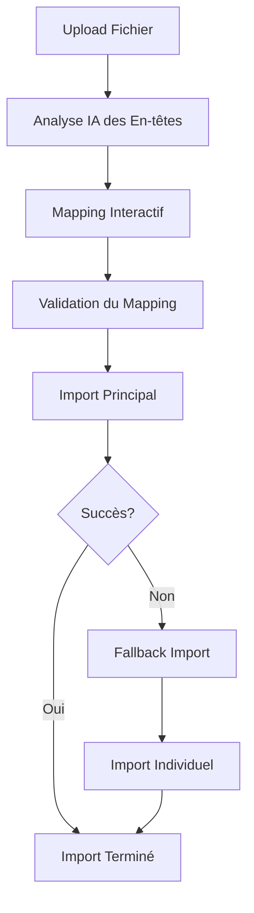

# 📊 Documentation des APIs Excel - TEN Capital Frontend

## 🎯 Vue d'ensemble

Le système d'importation Excel intelligent utilise **8 APIs backend** pour fournir une expérience d'importation complète avec IA, validation, et gestion d'erreurs robuste.

## 🔧 APIs Implémentées

### 1. **POST /api/excel/import** - Import principal avec IA
- **Fonction :** `performExcelImport(file, mapping, headers)`
- **Usage :** Import final avec mapping personnalisé et analyse IA
- **Paramètres :**
  - `file`: Fichier Excel/CSV
  - `mapping`: Mapping personnalisé des colonnes
  - `headers`: Analyse des en-têtes
- **Retour :** `{ success: boolean, data: object, error: string }`

### 2. **POST /api/excel/upload** - Upload alternatif
- **Fonction :** `performExcelUpload(file)`
- **Usage :** Upload simple sans traitement IA
- **Paramètres :**
  - `file`: Fichier Excel/CSV
- **Retour :** `{ success: boolean, data: object, error: string }`

### 3. **POST /api/excel/preview** - Prévisualisation des données
- **Fonction :** `performExcelPreview(file)`
- **Usage :** Aperçu des données avant import
- **Paramètres :**
  - `file`: Fichier Excel/CSV
- **Retour :** `{ success: boolean, data: object, error: string }`

### 4. **POST /api/excel/analyze-headers** - Analyse des en-têtes avec IA
- **Fonction :** `performExcelAnalyzeHeaders(headers)`
- **Usage :** Analyse intelligente des en-têtes pour mapping automatique
- **Paramètres :**
  - `headers`: Array des en-têtes du fichier
- **Retour :** `{ success: boolean, data: object, error: string }`

### 5. **POST /api/excel/validate-mapping** - Validation de mapping
- **Fonction :** `performExcelValidateMapping(mapping, headers)`
- **Usage :** Validation du mapping personnalisé
- **Paramètres :**
  - `mapping`: Mapping à valider
  - `headers`: En-têtes analysés
- **Retour :** `{ success: boolean, data: object, error: string }`

### 6. **GET /api/excel/mapping-info** - Informations sur le mapping
- **Fonction :** `getExcelMappingInfo()`
- **Usage :** Récupération des informations de mapping requises
- **Retour :** `{ success: boolean, data: object, error: string }`

### 7. **GET /api/excel/user/:userId** - Données Excel utilisateur
- **Fonction :** `getExcelUserData(userId)`
- **Usage :** Récupération des données Excel d'un utilisateur
- **Paramètres :**
  - `userId`: ID de l'utilisateur
- **Retour :** `{ success: boolean, data: object, error: string }`

### 8. **PUT /api/excel/mark-processed** - Marquer comme traité
- **Fonction :** `markExcelProcessed(fileId, processed)`
- **Usage :** Marquer un fichier comme traité
- **Paramètres :**
  - `fileId`: ID du fichier
  - `processed`: Boolean (true/false)
- **Retour :** `{ success: boolean, data: object, error: string }`

## 🚀 Fonctionnalités Avancées

### **Système de Fallback Intelligent**
- **Import principal** → En cas d'erreur 500 → **Fallback automatique**
- **Extraction CSV** → **Mapping manuel** → **Import individuel**

### **Outils de Test et Diagnostic**
- **Test All Excel APIs** : Test complet de toutes les APIs
- **Test Upload API** : Test de l'upload alternatif
- **Test Preview API** : Test de la prévisualisation
- **Test User Data API** : Test des données utilisateur
- **Mapping Info** : Informations sur le mapping requis

### **Gestion d'Erreurs Robuste**
- **Erreur 400** : Requête invalide avec détails
- **Erreur 401** : Authentification échouée
- **Erreur 403** : Permissions insuffisantes
- **Erreur 500** : Erreur serveur avec proposition de fallback

## 📋 Workflow d'Import



## 🛠️ Utilisation

### **Import Standard**
1. Sélectionner un fichier Excel/CSV
2. L'IA analyse automatiquement les en-têtes
3. Ajuster le mapping si nécessaire
4. Valider et importer

### **Test des APIs**
1. Utiliser les boutons de test dans la toolbar
2. Vérifier les logs de la console
3. Analyser les résultats des tests

### **Fallback en cas d'erreur**
1. Le système détecte automatiquement les erreurs 500
2. Propose l'import de fallback
3. Import individuel des enregistrements

## 🔍 Debug et Monitoring

### **Logs Détaillés**
- Tous les appels API sont loggés
- Gestion d'erreurs spécifique par code de statut
- Informations de debugging complètes

### **Tests Automatisés**
- Test de toutes les APIs en une fois
- Validation des réponses
- Rapport de succès/échec

## 📊 Structure des Données

### **Mapping Standard**
```javascript
{
  'investorType': 'investorType',
  'firstName': 'firstName',
  'lastName': 'lastName',
  'email': 'email',
  'location': 'location',
  'sector': 'sector',
  'industries': 'industries',
  'investmentStage': 'investmentStage',
  'revenueCriteria': 'revenueCriteria'
}
```

### **Réponse API Standard**
```javascript
{
  success: boolean,
  data: {
    importedCount: number,
    errors: array,
    warnings: array
  },
  error: string,
  status: number
}
```

## 🎯 Avantages

✅ **8 APIs Excel complètes** intégrées
✅ **Système de fallback** automatique
✅ **Tests et diagnostic** intégrés
✅ **Gestion d'erreurs** robuste
✅ **Interface utilisateur** intuitive
✅ **Logs détaillés** pour le debugging
✅ **Workflow intelligent** avec IA

---

*Documentation générée automatiquement - TEN Capital Network*
